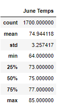
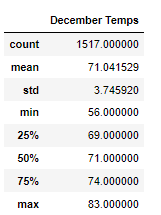

# Surfs_up

## Overview of the statistical analysis:
W. Avy wants more information about temperature trends before opening the surf shop. Specifically, he wants temperature data for the months of June and December in Oahu, in order to determine if the surf and ice cream shop business is sustainable year-round.

The following tools will be used: Python, SQLite, and SQLAlchemy.

## Results:

- There are 1700 and 1517 temperature records collected for the month of June and Decemeber in Oahu.

## Summary:
- There is a high-level summary of the results and there are two additional queries to perform to gather more weather data for June and December. (5 pt)